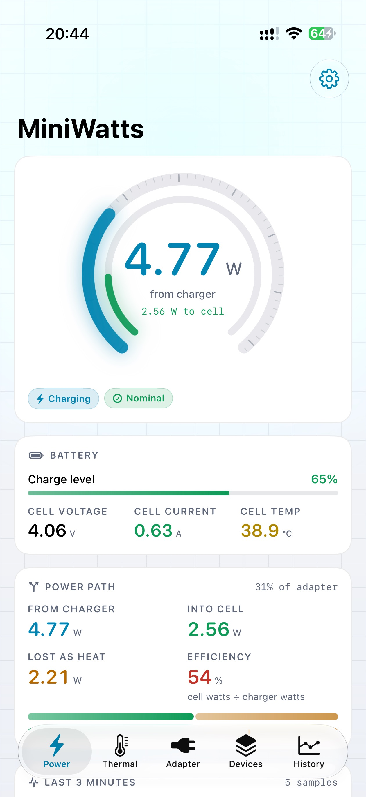
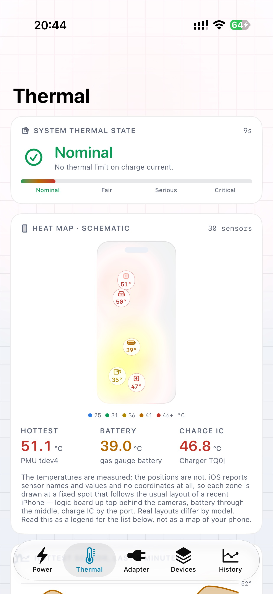
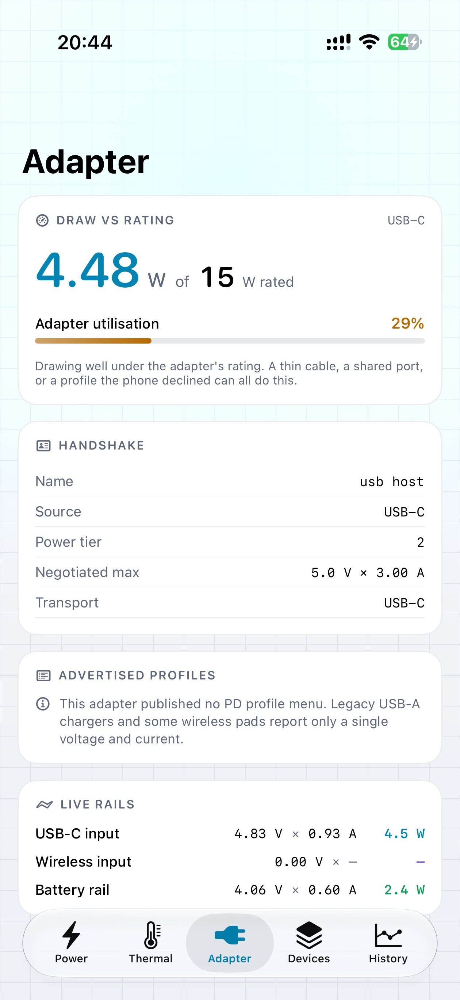
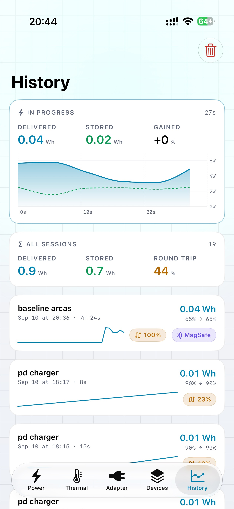

# MiniWatts

**English** · [简体中文](README.zh-Hans.md)

[](https://github.com/ResistanceTo/MiniWatts/actions/workflows/build.yml)

An iPhone battery and charging monitor built on Apple's private APIs. It reads the
phone's own power-management sensors — the ones iOS uses to run the charge — and shows
what the charger is delivering, how much of it reaches the cell, where the rest goes as
heat, and what every temperature sensor in the phone is doing while it happens.

| Power | Thermal | Adapter | History |
|:-:|:-:|:-:|:-:|
|  |  |  |  |

> **Sideload only.** Private APIs mean this can never be on the App Store — you sign
> and install it yourself. There is no network code of any kind: nothing it reads
> leaves your phone.

## Install

Download the latest `MiniWatts-unsigned.ipa` from
[Releases](https://github.com/ResistanceTo/MiniWatts/releases) and sign it with your own
Apple ID — [Sideloadly](https://sideloadly.io), [AltStore](https://altstore.io),
[SideStore](https://sidestore.io) and Xcode all do this. A free Apple ID works; the app
then expires after seven days and you re-sign it.

Requires iPhone, iOS 17 or later.

Or add the source to SideStore or AltStore — including the SideStore bundled with
LiveContainer — and install from there, so new versions show up as updates:

```
https://github.com/ResistanceTo/MiniWatts/releases/latest/download/apps.json
```

LiveContainer cannot run app extensions, so installed inside it MiniWatts has no widget
and no Live Activity.

MiniWatts includes a Home Screen and Lock Screen widget, and a Live Activity while
charging. The widget extension is one more App ID when you sign — a free Apple ID gets
ten a week — and if your signing tool offers to remove extensions, doing so removes the
widget.

## What it can't do

Sensor names, scales and even which sensors exist differ by iPhone model, and none of
it is documented. This build was written and verified on an iPhone Air; on another
model a reading can be missing or mean something other than its name suggests.
Impossible values — a charge IC at −9199 °C, which someone really did see — are hidden
rather than shown, but a wrong value that looks plausible cannot be caught that way.
Please report anything surprising with your model identifier.

Only what iOS actually hands a sandboxed app. Battery health and cycle count are
filtered out of the registry; accessory batteries (Watch, AirPods) come back empty;
wireless charging exposes no input current, so on MagSafe you only see what reaches the
cell; discharge power has no sensor and is estimated from the percentage. Charging holds
can only be inferred, and the app labels them `inferred` when that is what happened.

Widgets refresh when iOS decides to, usually every 15 to 60 minutes, and each one shows
when its numbers were taken. The Live Activity only updates while MiniWatts is running;
once the app is suspended it shows the reading as paused. Neither can be made to update
once a second — that budget is the system's to spend, not the app's.

For a reading that does move once a second while you are in another app, open the
floating meter from Settings: a small Picture in Picture window that keeps MiniWatts
running, so it also records the charge with the screen locked. It costs battery, and
you close it yourself. It plays no sound — Picture in Picture is a video feature, which
is the only reason the app declares audio playback at all.

## Build

Xcode 26 or later, iOS 17 deployment target, no dependencies.

```bash
./scripts/build-ipa.sh                             # unsigned, what Releases ships
TEAM_ID=ABCDE12345 ./scripts/build-ipa.sh signed   # signed, for your own device
```

[`CLAUDE.md`](CLAUDE.md) is the engineering notebook: which APIs the sandbox blocks and
how that was established, what each sensor turned out to be, and the Swift 6 isolation
traps this project has already fallen into.

## Licence

Apache 2.0 — see [LICENSE](LICENSE). The method for reading the PMU is derived from
[ios-charging-monitor](https://github.com/gregsramblings/ios-charging-monitor) (MIT);
`BatteryCenterBridge` owes two details to [Batsie](https://github.com/leptos-null/Batsie).
Both are credited in [NOTICE](NOTICE), which carries the upstream MIT notice.

Private APIs can change or disappear in any iOS update.
